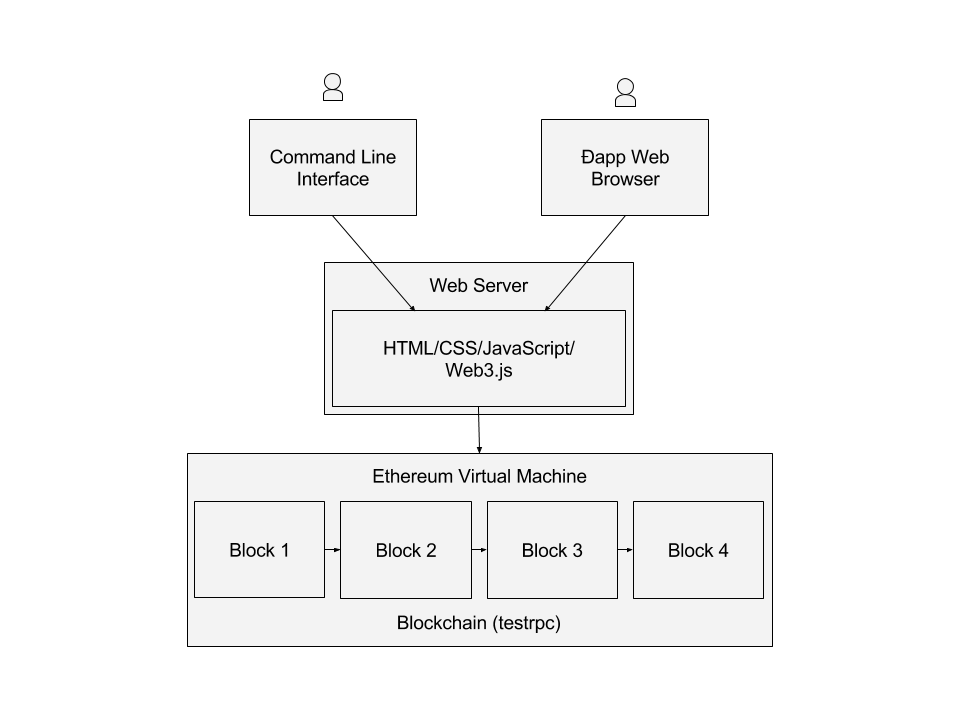
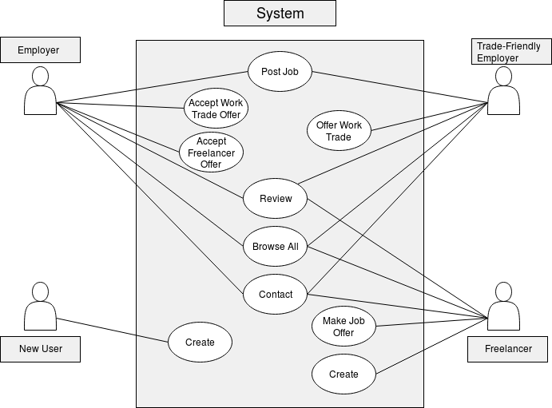
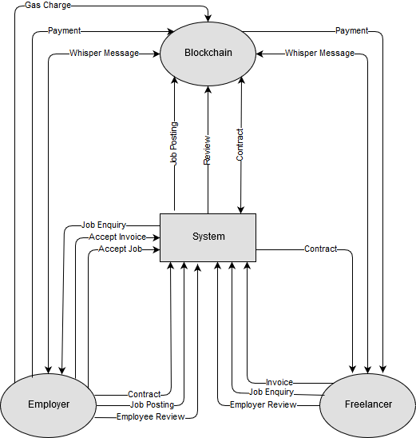
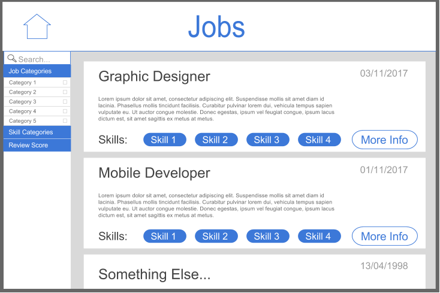
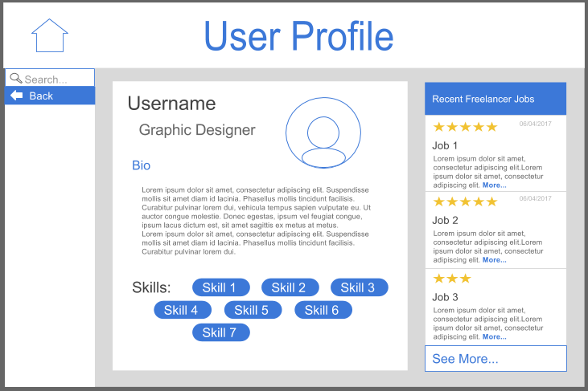
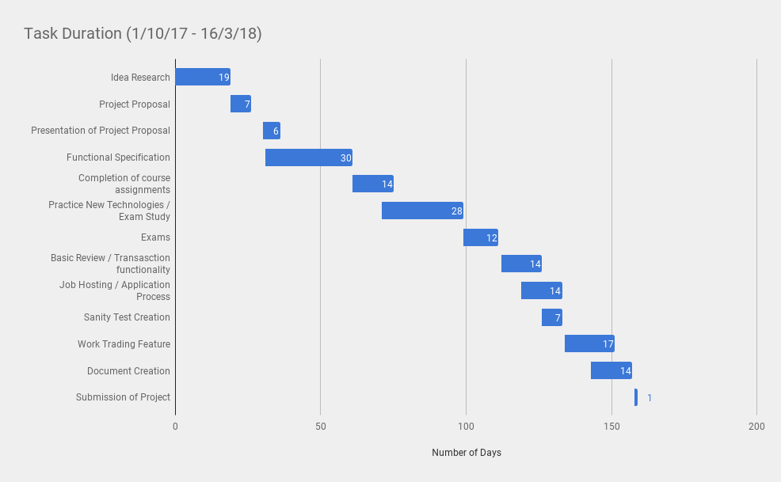

# Open Freelance hub
## CA326 Functional Specification
Dean Lynch & David Weir

## Table of Contents
* [1. Introduction](#1-introduction)
    * [1.1 Overview](#11-overview)
    * [1.2 Business Context](#12-business-context)
    * [1.3 Scope](#13-scope)
    * [1.4 Glossary](#14-glossary)
* [2. General Description](#2-general-description)
    * [2.1 Product / System Functions](#21-productsystem-functions)
    * [2.2 User Characteristics and Objectives](#22-user-characteristics-and-objectives)
    * [2.3 Operational Scenarios](#23-operational-scenarios)
    * [2.4 Constraints](#24-constraints)
* [3. Functional Requirements](#3-funtional-requirements)
* [4. System Architecture](#4-system-architecture)
* [5. High-Level Design](#5-high-level-design)
    * [5.1 User Diagram](#51-user-diagram)
    * [5.2 Context Diagram](#52-context-diagram)
* [6. User Interface](#6-user-interface)
    * [6.1 Browse Jobs Mockup](#61-browse-jobs-mockup)
    * [6.2 Job Details Mockup](#62-job-details-mockup)
    * [6.3 User Details Mockup](#63-user-details-mockup)
* [7. Test Plan](#7-test-plan)
* [8. Preliminary Schedule](#8-preliminary-schedule)
    * [8.1 Overview of Schedule](#81-overview-of-schedule)
    * [8.2 Task View](#82-task-view)
    * [8.3 GANTT Chart](#83-gantt-chart)
* [9. Appendices](#9-appendices)

---

## 1. Introduction

### 1.1 Overview

This is an application to replace the middle-man from online freelance/contract work services by moving transactions onto the blockchain, providing a public, immutable ledger of past transactions to show a complete and unconcealable history of each party involved. It also gives small businesses and startups an alternative to hiring freelance workers, with an option to trade work with other small businesses and startups.

At the moment, the freelance and contractor workspace online is primarily dominated by private companies who host job postings and more importantly, they control the reviews of the users of their site. How do we know that the reviews shown by these companies are unaltered and that they are not cherry-picking the reviews they choose to show for certain users? For example, an employer threatens to move to an alternate service if a negative review isn’t removed, in an attempt to cover up their wrongdoing. Placing these transactions on a blockchain will provide a more open and honest marketplace for freelance job openings.

A unique aspect of this project would be the possibility for two parties to trade work/services with each other, which could benefit small businesses who are struggling with funding the services that they outsource. For example two small business owners, one specialising in Accounting and the other in building business plans, could swap book balancing in exchange for an analysis of the others business plan. In this case similarly, the blockchain would act as a public record of past exchanges, with reviews of the quality of work etc...

### 1.2 Business Context

The Open Freelance Hub could be deployed in competition alongside some of the private online freelance organisations that are in use in the real world today. This system would appeal to users of these sites, both employers and employees, as it would provide them with a more open and transparent marketplace for them to work in.

With the storage of transaction information and reviews in a public ledger, more power would be provided to the users of the site as they do not have to worry about the behind-the-scenes actions of a trusted third party. Small businesses and startups would also be attracted to this marketplace as it would allow them to trade work and services as opposed to paying for work entirely using the Ether cryptocurrency.

### 1.3 Scope

Our goal is to produce the minimum viable product (MVP) as soon as possible. The MVP in this case is a site that will allow two users to trade Ether with each others Ethereum accounts for some amount of work completed. Users should be able to browse job postings and apply to relevant jobs. These users should also be able to review each other: the most basic form of this will be a score out of five. As part of the MVP the information associated with each transaction will be stored on the Ethereum blockchain.

Once the MVP is created, we aim to develop the function of the site which will allow users to trade work with each other rather than with Ether alone. This feature may be out of scope as it may interfere with the development of basic site functionality.

The following are most likely out of scope, but would be good additions to this project. We hope to expand the review function by allowing users to provide a more detailed review of the other party. This is not part of the the MVP as it creates a difficult problem due to some users using profane language and the immutable nature of the blockchain. If all previous items are completed we will then aim to add some form of communication between users using the Ethereum whisper protocol. This is not part of the scope as the same functionality can be completed using existing Ðapps.

### 1.4 Glossary
- **Blockchain**: A distributed digital public ledger that records transactions accross multiple computers to prevent transaction history from being altered.
- **Smart Contracts**: Self-executing programmable contracts that allow for the transfer of currencies on the blockchain, and the updating of the public ledger.
- **Ethereum**: An open platform that allows for the development of decentralised applications.
- **Ether**: The common cryptocurrency used in the Ethereum environment.
- **Ðapp**: An app consisting of a user interface and a decentralised backend built on the the Ethereum blockchain.
- **Gas Price**: The price paid to process a contract or transaction onto the Ethereum blockchain.
- **Solidity**: The language used to program smart contracts for the Ethereum blockchain.
- **web3.js**: A JavaScript API compatible with the Ethereum blockchain.
- **MetaMask**: A browser plugin for Chrome and Firefox which allows you to browse Ðapps without running a full Etherium Node.

---

## 2. General Description

### 2.1 Product/System Functions

The main focus of this project is to provide an open and completely honest platform for both employers and employees to buy and trade work contracts between one another. Employers will create job listings which workers can then apply to. Employees can build their skill profile, which employers can use to decide if the worker is a good fit for the position they are looking to fill. On top of this, both employer and employee will have a complete record of all previously fulfilled contracts and transactions, as well as a reviews of all the work provided by the opposite parties that the user has worked with.

Every transaction, contract and review created/completed will be directly associated with each account holder and saved onto the Ethereum blockchain. This will give the user peace of mind while reviewing potential employers/employees that every detail provided is genuine. What’s unique about our service is that we plan to allow businesses to trade contracts with each other directly, only requiring each party to pay the maintenance fees. This feature is particularly aimed at small businesses who require urgent work, but may not have the necessary funds at the time.

### 2.2 User Characteristics and Objectives

The prospective users for this site include:

- Any current users of similar sites who either wish to move to a more open marketplace or would like to start earning Ether for their work.
- Contractors who work primarily offline that are looking to modernise by moving their business online.
- Owners of small businesses or startups who outsource some of their work, these users in particular could benefit from the trading work service we hope to provide.

In order for users to be able to use this site correctly some basic knowledge of blockchain and Ethereum in particular will be needed, such as how Ether is transferred, the cost of gas/Ether, etc… Although the knowledge needed to perform transactions in Ether is minimised by the use of easy-to-use programs such as MetaMask for Chrome and others, which make it easier to transfer Ether between accounts.

### 2.3 Operational Scenarios

##### Scenario 1 -  New User:

1. User enters site with connected Ethereum account.
2. User chooses register account.
3. User chooses either employer or freelancer.
4. The user will then be asked to fill out a bio for their account, with experience, skills etc.. for freelancer and employers will fill out their own employer information.

##### Scenario 2 - Employer Creates a Job:

1. User enters site with employer registered user account.
2. Employer chooses create job.
3. Employer fills in description of job and tags it with appropriate skills.
4. Once the employer pays the necessary gas prices for posting, the job is live.

##### Scenario 3 - Employer Browsing Candidates:

1. Employer will create a job listing.
2. Employer can search through all active candidates who are looking for employment based on the skills listed on their profile.
3. Employer can contact a freelancer to ask them to apply.
4. The employer will be provided with a list of all freelancers who have applied.

##### Scenario 4 - Freelancer Browsing Available Jobs:

1. User enters site with freelancer registered user account.
2. Landing page is displayed with all open jobs.
3. User can filter available jobs by the skills that the jobs are tagged with.
4. When the user finds a job they wish to apply for, they enter their price per hour and an estimate of time.
5. The freelancer's account is added to a list of candidates for the employer to view.

##### Scenario 5: Completing a Job:

1. A freelancer is chosen for a job
2. Freelancer completes the work.
3. Invoice for the hours worked is paid by employer.
4. Review of each user is completed by the other user, paid to be stored on the blockchain by employer.

##### Scenario 6: Two Users Trading Work:

1. Employer posts a job, says in the posting that they are available for trading work.
2. This employer contacts another employer who is available for trading OR is contacted by another trade-friendly employer.
3. The two employers come to an agreement of how much work each should complete.
4. Employers agree that work is completed to a satisfactory amount. Contract is completed.

##### Scenario 7: Review Containing Bad Language:

1. A job is completed and payment is processed.
2. Both parties involved review the other, one user uses bad language in their review  and the review is placed on the blockchain.
3. Another user views the employer from the previous transaction and views the reviews for this employer.
4. The review containing the bad language is censored for the new user.

### 2.4 Constraints

##### 2.4.1 Learning:

We will need to spend some amount of time getting to grips developing on the Ethereum platform (Programming smart contracts with Solidity and interaction between the blockchain and web3js), as this is a unique style of programming.

##### 2.4.2 Ethereum:

This project requires that the Ethereum environment does not become less stable than it has in the past months. As Ethereum is relatively new it is possible that we may be constrained by a feature that has not been added yet / is too buggy for general use.

##### 2.4.3 Security:

A great deal of care must be taken when dealing with people’s money, so we must ensure that our site functions reliably and efficiently. Less efficient code costs real world money when using Ethereum as it impacts the cost to add it to the blockchain.

##### 2.4.4 Time:

The project must be completed by Friday 9th March 2018, which provides roughly three months from time of writing to complete the project (A relatively tight timeline when other college work is included).

##### 2.4.5 Slander:

It was brought up during our proposal presentation that we will need some way to handle slander and bad language in the reviews. This will be a difficult problem due to the immutable nature of the blockchain.

##### 2.4.6 User requirements:

At a bare minimum the completed project must be able to allow for the payment of work completed between two parties for a certain amount of work completed.

---

## 3. Funtional Requirements

### 3.1 Posting a Job:

##### Description:
- Employer accounts must be the only account that is able to post jobs to the site.

##### Criticality:
- Very important to the use of the system as employers will create jobs that the site is designed to cater for.

##### Technical Issues:
- Limiting posting features to certain Ethereum accounts could raise issues.

##### Dependencies:
- N/A

### 3.2 Applying to a Job:

##### Description:
- Freelancer accounts can apply to open jobs, with a price and estimate. A list of candidates that apply is accessible to the employer who posted the job.

##### Criticality:
- Integral part of the system as this is how workers for jobs will be selected.

##### Technical Issues:
- Possible issues with limiting functions to certain Ethereum accounts.

##### Dependencies:
- Relies on 3.3 as freelancers must be able to find jobs.

### 3.3 Browsing All Open Jobs/Available Candidates:

##### Description:
- All users of the site, regardless of whether they are employer or freelancer users will be able to browse all jobs and candidates. Employer can contact candidates to apply to job.

##### Criticality:
- Very important piece of the system as this is how the two people needed for a transaction will come in contact.

##### Technical Issues:
- Pulling all available jobs from the blockchain in order to display them may cause issues.

##### Dependencies:
- Relies on 3.1 as it requires jobs to be posted.

### 3.4 Employer Accepts Candidate:

##### Description:
- Employer chooses a candidate from the list of applications. Candidate is notified.

##### Criticality:
- Another integral part of transactions on the site.

##### Technical Issues:
- Notifying the accepted candidate could cause issues, unsure if this can be accomplished through Ethereum.

##### Dependencies:
- Relies on the apply and job posting functionalities.

### 3.5 Trading Work Instead of Currency:

##### Description:
- Employers who have chosen the work trade option when creating their job will be able to browse other trade-friendly employers in a similar way that they browse users, contact each other in the same way, and complete a trade contract instead of a normal transaction contract.

##### Criticality:
- Not part of the basic functionality of the service but will be a nice addition on top of the basic functionality.

##### Technical Issues:
- Development of an Ethereum smart contract could be difficult when not primarily trading in Ether.

##### Dependencies:
- Will rely on the browse and job posting functionality of the site.

### 3.6 Contact Between Users:

##### Description:
- Users can contact each other to arrange the terms of the contracts.

##### Criticality:
- Not as critical as previous requirements as users could simply have their chosen emails associated with their accounts instead.

##### Technical Issues:
- A built-in version could be developed using the Ethereum whisper protocal, although the same could be achieved through email.

##### Dependencies:
- Will rely on the browse, apply and job posting functionality.

---

## 4. System Architecture

---

## 5. High-Level Design

### 5.1 User Diagram

### 5.2 Context Diagram

---
## 6. User Interface

Below are mock ups of possible user interfaces that could be used on the site. The images showcase some of the information that will need to be displayed to users such as the skills required for a job/the skills a candidate has, and some of the past reviews of transactions associated with the user. The development of mockups forced a more in-depth analysis of the different features of the site.

### 6.1 Browse Jobs Mockup

### 6.2 Job Details Mockup

### 6.3 User Details Mockup

---

## 7. Test Plan

Testing will be an important part of this project. We will need to be certain of how our code works as cryptocurrency prices can be very volatile and as a result of this, a small error in our codes price or gas calculations could result in a substantial loss of money for some of our users.

We plan for this project to be continously tested. The Truffle development framework we plan to use for smart contract development allows for the creation of unit test cases that can be run in groups, individually or can be programmed to run automatically whenever a build is compiled.

Once the basic site is complete we will create a series of simple test cases to act as our sanity test for each new build we deploy. In addition to this we will have test cases based around each new feature we implement after the minimmum viable products development.

## 8. Preliminary Schedule

### 8.1 Overview of Schedule

We attend a meeting with our project supervisor every Wednesday at 10:00am. This is an open meeting where three other project groups are also in attendance. This allows us to hear exactly how the other groups are progressing and the ideas that they’ve come up with, some of which could be helpful in our own project. This open meeting style also allows us to give our input on the ideas of the other groups, and vice versa. Each week we take turns to give a description of the project, what we accomplished in the past week, as well as what we aim to accomplish in the upcoming week. This helps us to stay on target and keep a steady progress.

Below we have a provisional Task View and GANTT chart which we plan to update throughout the course of our project.

### 8.2 Task View

|**Task Name**                              |**Start**      |**End**            |**Duration**   |**Status**     |
|-------------------------------------------|---------------|-------------------|---------------|---------------|
|**Idea Research**                          |**1/10/17**    |**11:59 20/10/17** |**19d**        |**Completed**  |
|Idea Brainstorming                         |1/10/17        |11:59 10/10/17     |10d            |Completed      |
|Idea Feasibility Research                  |10/10/17       |11:59 20/10/17     |9d             |Completed      |
|**Project Proposal**                       |**20/10/17**   |**17:00 27/10/17** |**7d**         |**Completed**  |
|Write Proposal                             |20/10/17       |11:59 23/10/17     |3d             |Completed      |
|Finalise Proposal                          |20/10/17       |11:59 24/10/17     |1d             |Completed      |
|Approved by Supervisor                     |24/10/17       |11:00 25/10/17     |1d             |Completed      |
|Submit Proposal                            |26/10/17       |17:00 27/10/17     |1d             |Completed      |
|**Presentation of Project Proposal**       |**31/10/17**   |**12:00 6/11/17**  |**7d**         |**Completed**  |
|Prepare Slideshow                          |31/10/17       |11:59 4/11/17      |4d             |Completed      |
|Practice Presentation                      |5/11/17        |12:00 6/11/17      |3d             |Completed      |
|**Submission of Functional Specification** |**1/11/17**    |**17:00 1/12/17**  |**30d**        |**Completed**  |
|**Project Development**                    |**6/12/17**    |**17:00 8/3/18**   |**92d**        |**In Progress**|
|Create GitLab Project Page                 |27/10/17       |18:00 28/10/17     |1d             |Completed      |
|Practice Solidity & web3.js                |11/12/17       |11:59 8/1/18       |32d            |In Progress    |
|Basic Review / Transasction functionality  |21/1/18        |11:59 4/2/18       |14d            |-              |
|Job Hosting / Application Process          |28/1/18        |11:59 11/2/18      |14d            |-              |
|Sanity Test Creation                       |4/2/18         |11:59 11/2/18      |7d             |-              |
|Work Trading Feature                       |12/2/18        |11:59 1/3/18       |17d            |-              |
|Technical Manual / User Manual Creation    |21/2/18        |11:59 7/3/18       |14d            |-              |
|**Submission of Project**                  |**8/3/18**     |**17:00 9/3/18**   |**1d**         |**-**          |
|**Project Demonstrations**                 |**1/3/18**     |**17:00 16/3/18**  |**16d**        |**-**          |
|Prepare Presentation                       |1/3/18         |11:59 6/3/18       |6d             |-              |
|Finalise Presentation                      |6/3/18         |11.59 7/3/18       |1d             |-              |
|Practice Presentation                      |5/3/18         |11:59 11/3/18      |4d             |-              |
|Present Project                            |12/3/18        |17:00 16/1/18      |4d             |-              |

### 8.3 GANTT Chart

---

## 9. Appendices

**Ethereum Development:**
- https://ethereum.org/
- http://truffleframework.com/
- Various tutorials from https://medium.com/
- https://dappsforbeginners.wordpress.com/tutorials/introduction-to-development-on-ethereum/
- 'Building Blockchain Projects' by Narayan Prusty, Packt publishing
- 'Introducing Ethereum and Solidity' by Chris Dannen, Apress publishing

**Amazon Web Services:**
- https://aws.amazon.com/

**Forums:**
- https://ethereum.stackexchange.com/
- https://forum.ethereum.org/
