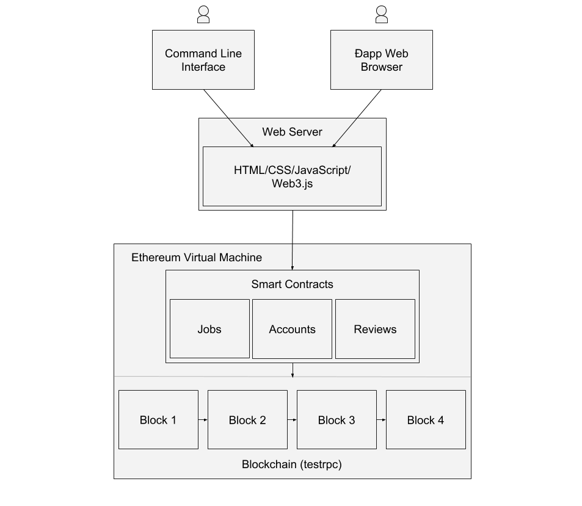
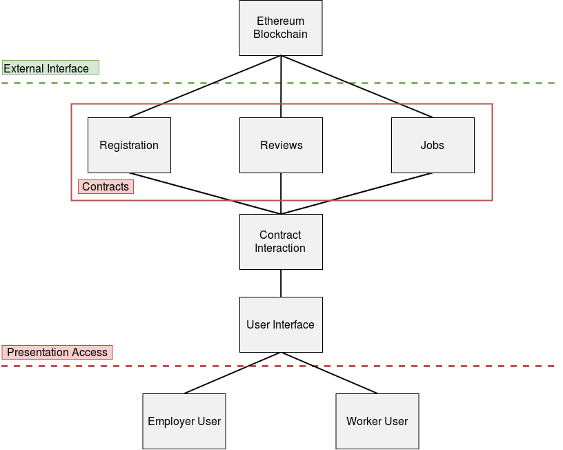
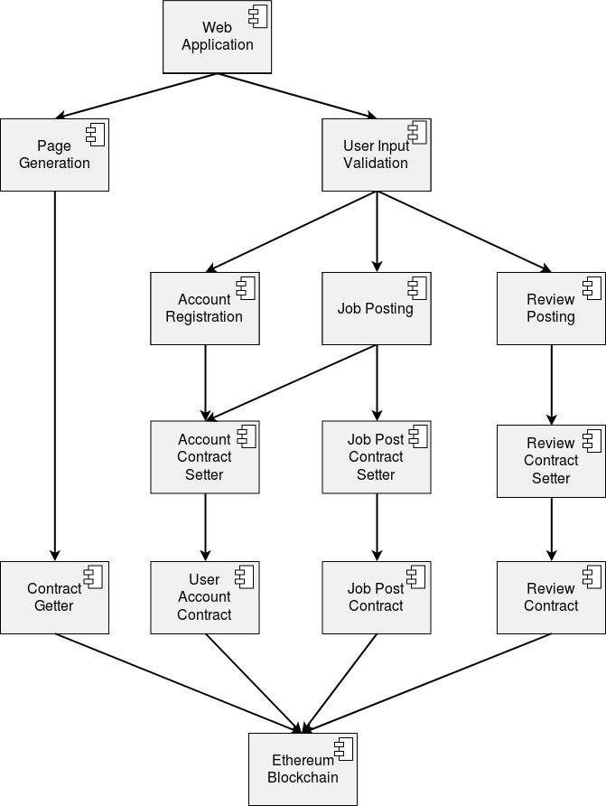
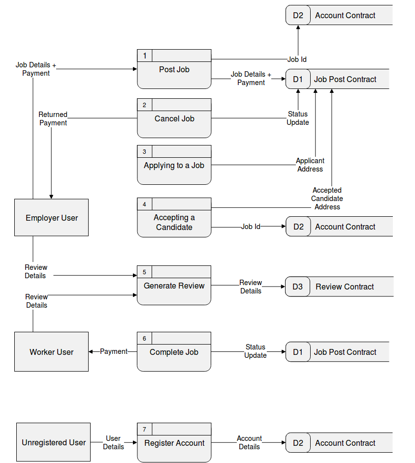
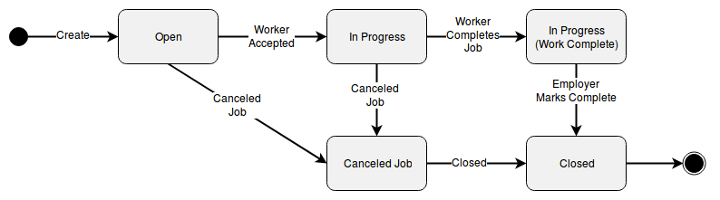
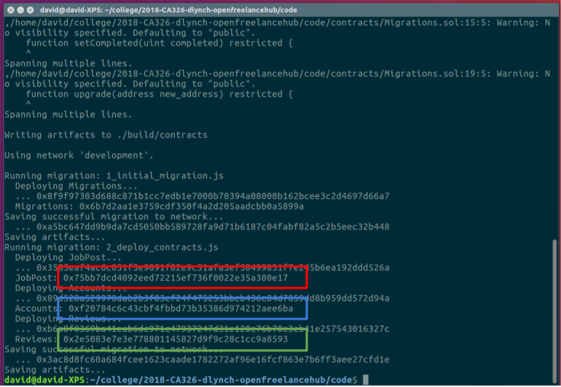
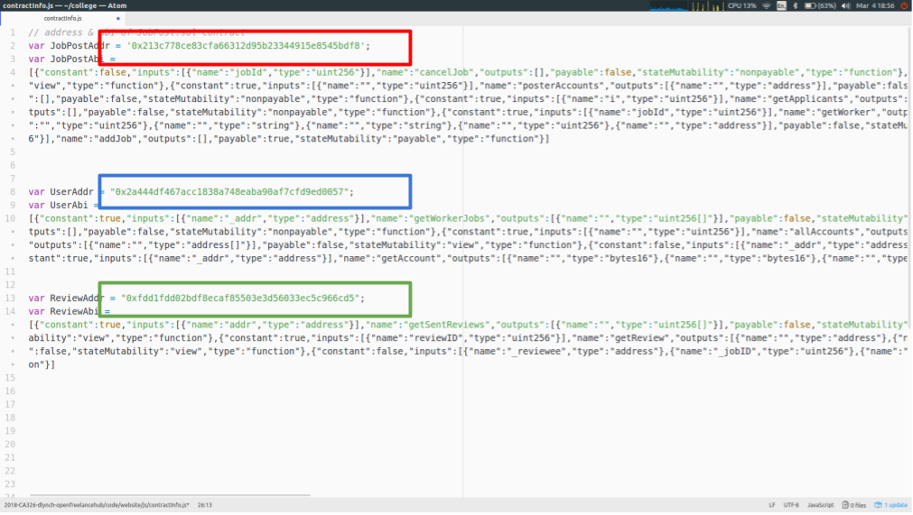
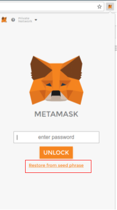
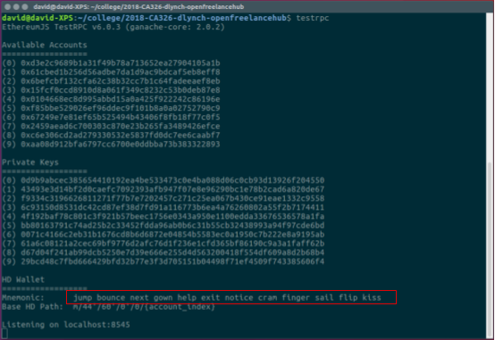
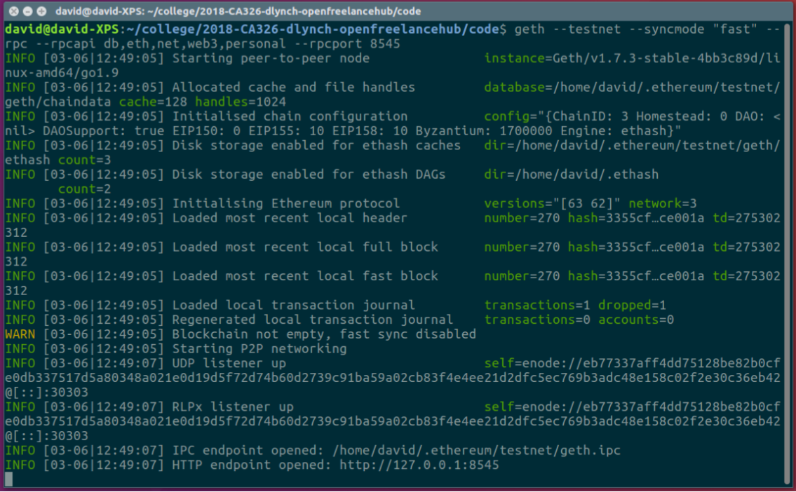

# Open Freelance hub
## Technical Manual
###### Dean Lynch & David Weir

### Table of Contents
* [1. Introduction](#1-introduction)
  * [1.1 Overview](#11-overview)
  * [1.2 Glossary](#12-glossary)
  * [1.3 Initial Design Vs Final Application](#13-initial-design-vs-final-application)
* [2. System Architecture](#2-system-architecture)
* [3. High Level Design](#3-high-level-design)
    * [3.1 Architectural Overview Diagram](#31-architectural-overview-diagram)
    * [3.2 Component Diagram](#32-component-diagram)
    * [3.3 Data Flow Diagram](#33-data-flow-diagram)
    * [3.4 State Diagram](#34-state-diagram)
* [4. Problems and Resolutions](#4-problems-and-resolutions)
* [5. Installation Guide](#5-installation-guide)
* [6. Future Work](#6-future-work)

### 1. Introduction

##### 1.1 Overview

The goal of Open Freelance Hub is to create a more open and transparent marketplace for freelance or casual work transactions. This application allows users to trade Ether, a cryptocurrency, for some amount of work completed. For example, a proofreader could be paid by a student for completing an analysis of their dissertation. With the growing popularity of blockchain based technologies, this application is a showcase of how blockchain "decentralised applications" can be used in place of commonly used applications.

##### 1.2 Glossary

- **Blockchain**: A distributed digital public ledger that records transactions across multiple computers to prevent transaction history from being altered.
- **Smart Contracts**: Self-executing programmable contracts that allow for the transfer of currencies on the blockchain, and the updating of the public ledger.
- **Ethereum**: An open platform that allows for the development of decentralised applications.
- **Ether**: The common cryptocurrency used in the Ethereum environment.
- **Ðapp**: An app consisting of a user interface and a decentralised backend built on the the Ethereum blockchain.
- **Gas Price**: The price paid to process a contract or transaction onto the Ethereum blockchain.
- **Solidity**: The language used to program smart contracts for the Ethereum blockchain.
- **web3.js**: A JavaScript API compatible with the Ethereum blockchain.
- **MetaMask**: A browser plugin for Chrome and Firefox which allows you to browse Ðapps without running a full Ethereum Node.

##### 1.3 Initial Design Vs. Final Application

The application that was developed achieves the minimum viable product that was outlined as part of the functional specification. Registered users have the ability to post jobs, browse both all jobs and all open jobs, apply to relevant jobs as a worker, and search for jobs based on job title and description.

Time was spent in an attempt to develop a chat functionality using the Whisper protocol, in hindsight this time was wasted as we discovered that the Whisper protocol is still heavily in development and severely lacking documentation, and therefore it would not be possible to integrate a chat functionality in time.

### 2. System Architecture

The Ðapp web browser or Ethereum enabled browser is a browser capable of interacting with the Ethereum blockchain through web3js. Development took place primarily on Chrome with the MetaMask extension. The Mist browser is also another option to interact with the Ethereum blockchain.

The front end of the application is written in HTML, CSS, & JavaScript, using Bootstrap and AngularJS. The content for the front-end is populated using web3js, a JavaScript library specifically used for interacting with smart contracts stored on the Ethereum blockchain. Ideally in a fully decentralised application, you would not use a web server; you would use a service called 'swarm' which can provide the front end via a peer-to-peer network. This was not used for this application as 'swarm' is still too early in development.

The smart contracts contained on the Ethereum blockchain are where the data for the application is stored. Written in Solidity, they perform the transactions necessary for completing a piece of work and store the relevant data for our users and their jobs.

### 3. High Level Design

##### 3.1 Architectural Overview Diagram

_Note_: Each of the users shown in the architectural overview diagram can collectively be one user. For example, the employer user for one job could be the worker user for a different job at the same time, and an unregistered user could become an employer user after they register their Ethereum account and post a job.

The A.O.D. is a high-level shared vision of the architecture and scope of the proposed application. It explores and evaluates alternative architectural options and enables early recognition and validation of the implications of the architectural approach. It helps to provides a conceptual understanding of the system. As shown in the diagram, the user interface interacts with a contract interaction section which will complete the main functionalities on the site using the smart contracts stored on the Ethereum blockchain.

##### 3.2 Component Diagram

The component model is used to illustrate at a high level how components will interact within a system. The component diagram can be viewed as a lower level version of the architectural overview diagram. The different sections of the architecural overview diagram are displayed as components. Components are functionalities in the system that complete a certain task.

For instance, the user interface section is broken down into page generation, user input validation and the different functionalities for the application. The contract interaction section is broken down into the various setters for the contracts and the contract getter used to populate the dynamic page generation.

##### 3.3 Data Flow Diagram

_Note_: As in the architectural overview diagram, the two employer and worker users can be one user.

A data flow diagram shows the flow of information for each process in our system.

##### 3.4 State diagram

A state diagram describes the behaviour of a system.

This state diagram displays the different possible states for a job as it is completed by users on the application.

### 4. Problems and Resolutions

##### Profanity in the application

- **Problem**: It was mentioned at our project proposal demonstration that we should be wary of the use of profanity by users in our application. As the storage for this application in on a blockchain, traditional moderation would be extremely difficult.
- **Solution**: We developed a profanity filter with 3000+ profane words. These words were gathered by scraping a number of online profanity lists and compiling our own list of the unique words. Much of these words are slight variations of the same word. In the filter we strip the words of any special characters in order to catch attempts circumvent the filter by appending special characters.

##### Dynamically creating unique webpages

- **Problem**: Each job created and account registered would need to have a unique webpage for displaying the information related to it. Accounts need to display user information, and jobs need to display the title, description of the work and payment amount for completeing the work. Similarly, it was necessary to generate a page of search results dynamically based on the search input.
- **Solution**: Passing the job ID's and account addresses as part of the URL for the webpages. This information is parsed when generating the page and it pulls the relevant information from the blockchain.

*Note*: This had the added benefit of allowing our users to share links with one another, as the data for generating each page would be parsed from the URL they shared.

##### Deploying to a live network

- **Problem**: There are many conflicting tutorials on how to deploy certain applications to the Ropsten test network, most of which did not work for our application. Deploying to a test network allowed us to see how our application would act on a live network.
- **Solution**: After trial and error, our application was deployed to the Ropsten test network. We created a tutorial as part of our blog in order for us to remember how to deploy our application to the test network.

##### Returning an array of values from a contract

- **Problem**: Solidity does not allow you to return an array of struct type, instead you must return a single struct as an array of multiple types. This was necessary in order for us to display lists of jobs (including all job details).
- **Solution**: It was beneficial to keep a count of all jobs in the job contract, and allow easy access using a getter function. This meant we could retrieve this total and get each job between 0 and total individually in a loop.

##### Lack of documentation

- **Problem**: Solidity, Truffle and many Ethereum based technologies are still in active development, this means that there is very little official documentation for many of the technologies we used. Of the documentation that is available, quite a lot of it is depreciated or conflicts with other documentation.
- **Solution**: We became members of publilc forum sites such as Ethereum Stack Exchange, Ethereum.org forum and Gitter chatrooms for some of the technologies used in this project. The Gitter chatrooms were particularly useful as in some cases we could interact with some of the open source developers of the projects.  

##### Updating smart-contract ABI's for JavaScript interaction

- **Problem**: When interacting with smart contracts on Ethereum using JavaScript you must include the ABI of the contracts you are interacting with. When developing the application we had to generate a new ABI whenever any changes were made to the contracts in any way. Each JavaScript file that interacts with the contracts must have access to this ABI and the address of the contract on the blockchain.
- **Solution**: In order to prevent us having to edit every JavaScript file whenever a change was made to one of the contracts, we centralised these ABI's and contract addresses. Each contract ABI and address is stored in a file called *contractInfo.js* which every JavaScript file has access to.

##### Creating a "fuzzy search"

- **Problem**: Originally, we had planned to search for jobs purely by keyword but we decided later on that it was best to implement a "fuzzy search" to allow our system to return jobs or users that are spelled similarly to the search input. Fuse.js is a JavaScript library which provides a "fuzzy search", however it is a node module which means that it cannot be run by the browser on our site.
- **Solution**: In order to allow the use of fuse.js by the browser we had to bundle the *search.js* file using a tool called browserify.

##### Populating pages using angular js and smart-contract calls

- **Problem**: The angular js used to populate pages would complete before many of the calls to get data from the contracts on the blockchain had returned, resulting in a blank page or an error.
- **Solution**: Once the data had been returned from the contracts we had to force angular to update any relevant variables using *$apply*.

##### Job List scalability

- **Problem**: As a larger number of jobs were added to the application, the job list & open job list slowed down greatly as initially every job posted on the application would be retrieved from the blockchain in order to display them all in one page.
- **Solution**: Modified job list and open job list to display jobs in a series of pages rather than on one page. The page information is passed as part of the URL similarly to the dynamic creation of webpages mentioned previously.

### 5. Installation Guide

##### 5.1 Local Installation

These steps will function as a walkthrough for deploying the application for use on a private blockchain on a local machine. All users will have to use the same machine when interacting with the site.

 **Requirements**: testrpc, truffle framework, chrome with MetaMask extension, lite-server node module

- Run testrpc in a terminal instance using the command *testrpc*. This will run a local instance of the blockchain.
- In a different terminal instance enter the code directory of this project, run the command *npm run dev*. This will run lite-server to host the website frontend.
- In another terminal instance, in the same directory, run the command *truffle migrate*. This will post the smart contracts to the local instance of the blockchain running with *testrpc*.
- Copy the addresses of each of the contracts, which are returned by the *truffle migrate* command, and place them into the *contractInfo.js* file in the js directory.

| **truffle migrate result**        | **contractInfo.js file** |
| ------------- | ------------- |
|     |  |

- Open chrome, choose *Restore from seed* in the MetaMask extension, copy the 12 word mnemonic from the *testrpc* terminal window into the popup and create a password.

| **MetaMask restore from seed**        | **testrpc mnemonic** |
| ------------- | ------------- |
|     |  |

- The application can now be used in chrome, at *localhost:3000*.

##### 5.2 Ropsten Deployment

These steps will function as a walkthrough for deplying the smart contracts to the Ropsten network. The front end can be hosted either locally using _npm run dev_ as in this walkthrough or a server for public users to access it. Similar steps have also ben outlined on our project blog.

**Requirements**: geth (Ethereum implement using go), truffle framework, chrome with MetaMask extension, lite-server node module

- Run geth using the following command in a terminal window: _geth --testnet --syncmode "fast" --rpc --rpcapi db,eth,net,web3,personal --rpcport 8545_

| **geth running in terminal**        |
| ------------- |
|     |

- In a separate terminal instance run the truffle console using: _truffle console --network ropsten_
- In the truffle console run: _web3.personal.unlockAccount(web3.eth.accounts[0], "-PASSWORD-HERE-")_
- Now run _migrate_ in the truffle terminal to deploy the contracts to the ropsten network.
- To run the front end simply run _npm run dev_ in a terminal as specified in the local installation steps above.

### 6. Future work

- Ability to add to the profanity filter based on a report system.
- Allow users to update their biography through the application after registratio has completed.
- Whisper chat functionality between an employer and an applicant.
- Swarm hosting of the appliction front-end to allow a fully decentralised deployment.
