    # Open Freelance hub
## Testing Report
###### Dean Lynch & David Weir

### Table of Contents
* [1. Use Case Testing](#1-use-case-testing)
* [2. Additional Test Cases](#2-additional-test-cases)
* [3. Smart Contract Unit Testing](#3-smart-contract-unit-testing)
* [4. Heuristic Testing](#4-heuristic-testing)
* [5. Real World Testing](#5-real-world-testing)
* [6. Known Issues](#6-known-issues)

###1. Use Case Testing

|Use Case No.|Title|Steps|Result|
| :-------------: | :-------------: | :------------- | :------------- |
|1|Posting a Job|1) Choose 'post a job'   2) Enter the details of a job   3) Click 'Post Job' & approve the transaction   **Expected Result**: Job is posted and is visible on the job list page| PASS |
|2|Applying to a Job|1) Create an open job as specified in Test Case 1   2) Sign into a different account   3) Enter the job page of the previously created job   4) Click the 'apply' button and approve the transaction   5) Sign into the the account that owns the job   6) Enter the job page   **Expected Result**: The address of the non-owner account is visible in the list of applicants| PASS |
|3|Accepting a candidate for a job|1) Apply to a job as in Test Case 2   2) As the owner of the job, click 'Accept' on an applicant   **Expected Result**: The address of the candidate appears as the 'Accepted Worker'. The status of the job is marked as 'In Progress'. | PASS |
|4|Reviewing another party|1) Accept a worker as in Test Case 3   2) As the accepted worker, enter the job page   3) Click 'Confirm work completed' and complete a review of the employer   4) As the owner of the job, choose 'Complete Job' and complete a review of the worker   **Expected Result**: Both reviews are completed. The job status is marked as closed. The payment amount is transferred to the worker. The reviews of each party can be seen on the job page.| PASS |
|5|Registering an ethereum account|1) Enter the site as an unregistered user   2) Choose 'Register Account'   3) Enter the details for the account   4) Click 'Register' and approve the transaction   **Expected Result**: The ethereum account is registered. The user details can be seen in the list of users, which will link to an account page for the new users. | PASS |  

###2. Additional Test Cases

|Test Case No.|Title|Steps|Result|
| :-------------: | :-------------: | :------------- | :------------- |
|6|Completing a Job|1) Post a job and accept a worker for the job   2) As the accepted worker, enter the job page and click 'Confirm work completed'   3) Complete a review of the employer for the job   4) As the owner of the job, enter the job page and click 'Complete Job'   5) Complete a review for the worker   **Expected Result**: The job is completed. The status of the job is set to closed. The payment amount specified in the job post is tranferred to the etheruem account of the accepted worker.| PASS|
|7|Searching for a Job|_Note_: The site must be populated with jobs for this test case.   1) Enter the search keywords for a job into the search bar   2) Click the 'Search' dropdown and selct 'search jobs'   **Expected Result**: A search results page is generated with the result of the search. The correct job that was searched for and is posted correctly, is returned | PASS|
|8|Searching for a User|_Note_: The site must be populated with users for this test case.   1) Enter the search keywords for a user into the search bar   2) Click the 'Search' dropdown and selct 'search users'   **Expected Result**: A search results page is generated with the result of the search. The correct user that was searched for and is posted correctly, is returned| PASS|
|9|Browsing Jobs|_Note_: The site must be populated with jobs for this test case.   1) Choose 'Browse Jobs' from the home page   2) Traverse the pages of the jobs   **Expected Result**: All jobs are displayed in a number of different pages. They have different statuses: Open, In Progress, and Closed | PASS |
|10| Canceling a Job | 1) Post a job and accept a worker for the job   2) As the owner of the job, enter the job page   3) Click 'Cancel Job' and approve the transaction   **Expected Result**: The job status is marked as 'Closed' in the job list. The payment amount for the job is returned to the owners account. | PASS |

###3. Smart Contract Unit Testing

The Truffle framework which we used in the development of this project allowed for the creation of unit tests written in JavaScript. We created a number of these while developing the different contracts used in the application. They can be viewed here: [test directory](./code/test).

They cover all of the functions used in the smart contracts to provide the functionality of the application. Each function does not have its own unit test, however every function is used in at least one function. For example, when testing whether or not a review is posted to the blockchain, both _postReview()_ and _getReview()_ are tested when running the _Should post a review_ unit test.

| **Unit Test Result**        |
| ------------- |
| 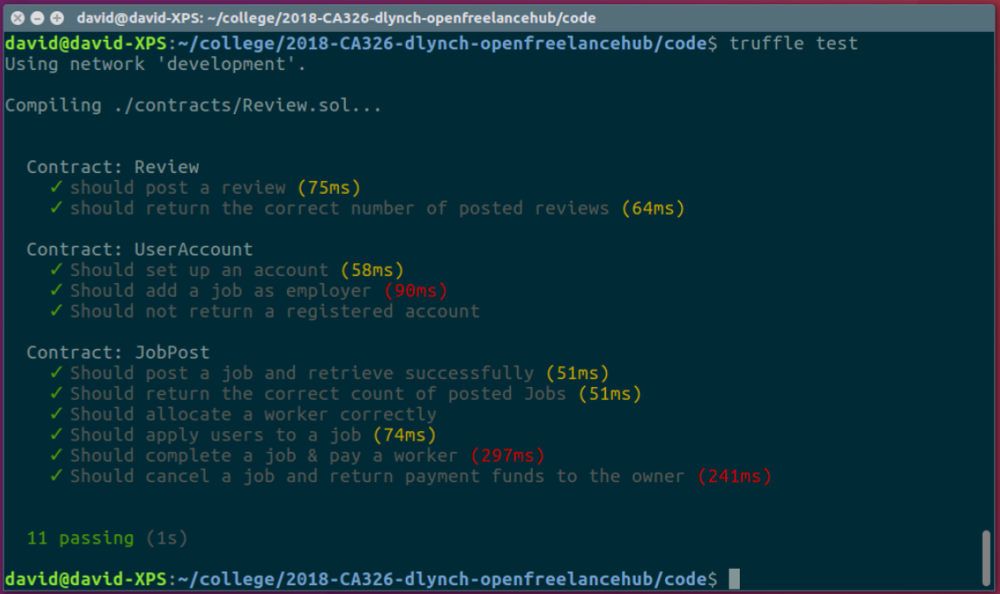   |

These tests can be run using the following command in the code directory: *truffle test* (_Note_: *testrpc* must be running in a separate terminal window)

###4. Heuristic Testing

##### Nielsen's Heuristics

- **Simple & Natural Dialog**: All dialogue with the user on the site is kept to a minimum. Dialog in the form of popups on the site is written in natural and logical language. General dialog such as that used on the homepage is also simple in order for users to figure out what they would like to do.
- **Speak the User's Language**: No complex language is used for the different dialogues in the application. However, some technical language/knowledge is unavoidable due to nature of blockchain applications and the fact that they are an emerging technology. This means that some knowledge of the blockchain is necessary when using any blockchain application.
- **Minimise the user's memory load**: The application functions in a very similar way to currently operating freelance sites, so any users of these sites would not find it difficult to begin using this application. All users will also be able to traverse the main functions of application the through the homepage.

| **Homepage**        |
| ------------- |
|     |

- **Consistency**: All language in the application is consistent in that it is kept simple as mentioned previously. The style of the site is also kept consistent as it keeps with the same theme throughout the application as shown in the screenshots below.

| **Job List**        | **Job Page** |
| ------------- | ------------- |
|     |  |
|**Account Page**|**Homepage**|
|||

- **Feedback**: When the user completes an action on the site, such as posting a new job or applying to a job, a popup is displayed informing them of the success of their action.

| **Job Post Success**        | **Account Registration Success** |
| ------------- | ------------- |
|     |  |

- **Clearly Marked Exits**: As this application is browser-based, the user can simply use the back button if they have entered an incorrect page. If the user has accidently posted a job, they can cancel the job which will return the payment amount of Ether to the user. They will however be charged the gas fee to process this cancellation.

| **Job Page**        |
| ------------- |
|     |

- **Good Error Messages**: When the user attempts to complete an action that is not allowed, they are informed as to why they are not allowed to compete it using a popup.

| **Job Post Error**        | **Account Registration Error** |
| ------------- | ------------- |
|     |  |

- **Prevent Errors**: When completing certain actions in the application, the user is asked to first confirm that they would like to complete it. This is in place in order to prevent users from cancelling jobs incorrectly etc...

| **Confirmation Popup**        |
| ------------- |
|     |

- **Help and Documentation**: Users have access to the user manual for the application through the settings section of the navigation bar. This manual will walk them through the functionality of the application.
**_ADD SCREENSHOT OF SETTINGS DROPDOWN WITH MANUAL_**

###5. Accessibility Testing

##### Sight Difficulties

- The text sizes throughout the application are all of large font size to ensure that any users who have difficulties with their vision can read the information on the application with great ease.
- The colour scheme of the site was chosen as it is both aesthetically pleasing and it provides a high contrast to help users with colour blindness.
- The result of an online colour analysis tool states that the colour used in our links fail the contrast ratio for some users. To combat this we changed the colour of the links and underlined them when hovering over it.
- In order to combat some of the other colour contrast issues, such as the different colours for marking the job status we stated what the status of the job is beside the coloured status indicator.

| **Analysis of Main Colours**        | **Colour Contrast Fix**        |
| ------------- | ------------- |
| 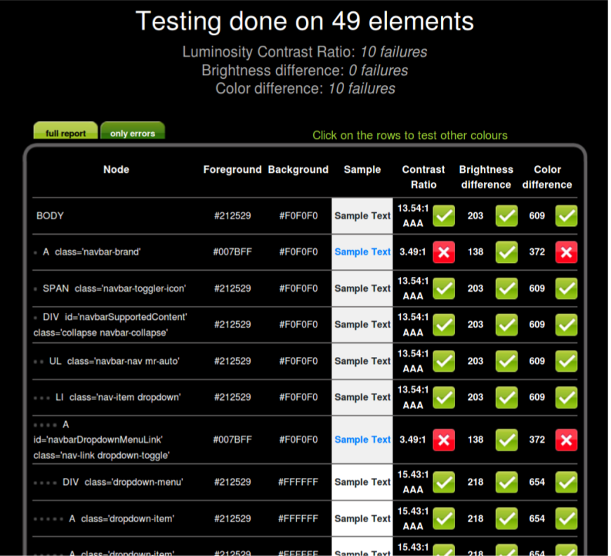    | 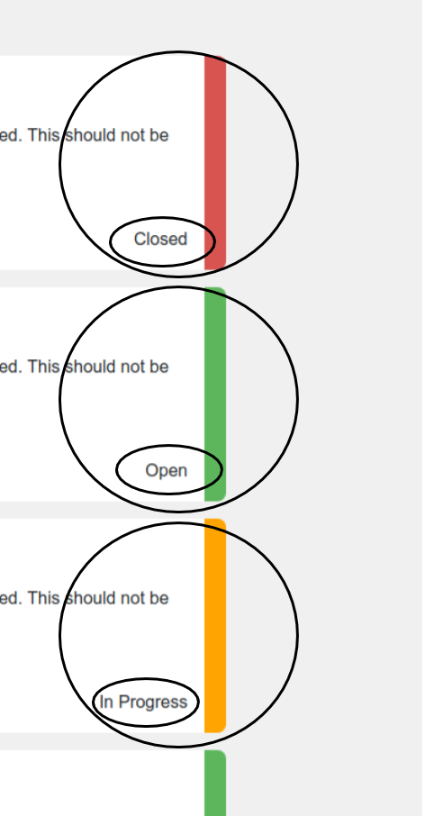    |

##### Motor Skill Difficulties

- The buttons and links, etc. used in the application are kept large.
- The dropdowns on the site do not disappear if the mouse moves off the dropdown as is the case on some sites. This can cause issues for users with Parkinsons, for example.

###6. Real World Testing (User Testing)

##### Test Plan

Each of the users who participated in our user testing were provided with a list of tasks and asked to complete these tasks before proceeding to delve freely into the site. The set of tasks cover the major functionalities of the application. The set tasks were as follows:
* Register an unregistered etheruem account.
* Post a job.
* Apply to a job.
* Accept an applicant for the job you have posted.
* Complete a job.
* Search for a job or user.

##### User Test Outcome

Once the user had finished testing the application they were given a survey to complete. An example of the survey can be seen below.

| **User Survey**                 |
| ------------------------------- |
| 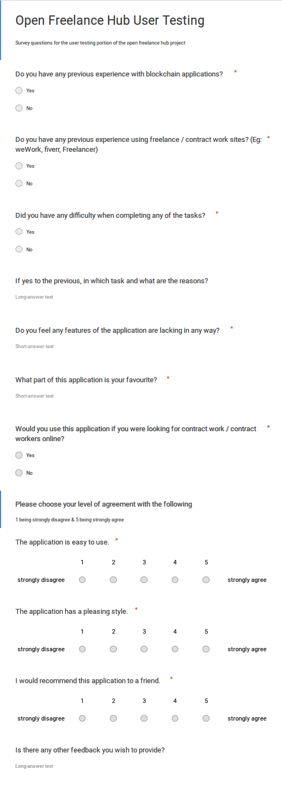    |

#### Results

| **Question 1**                        |
| ------------------------------------- |
| 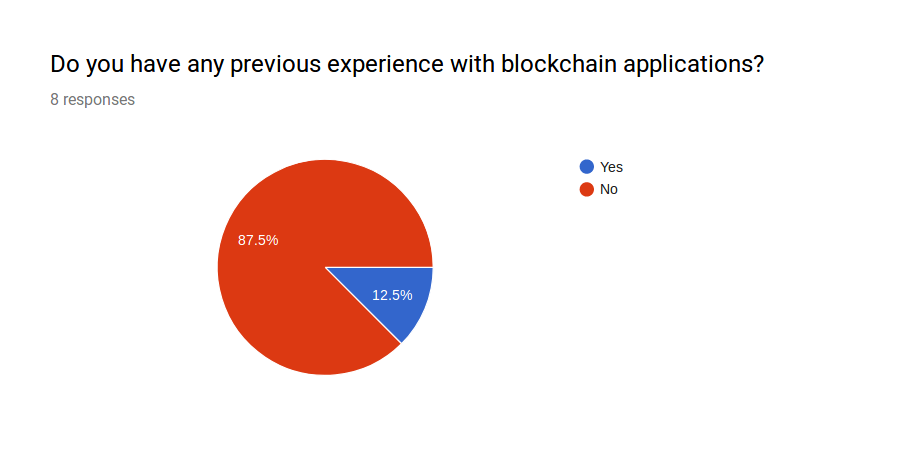    |
| The majority of users had no previous experience with blockchain applications |

| **Question 2**                        |
| ------------------------------------- |
| 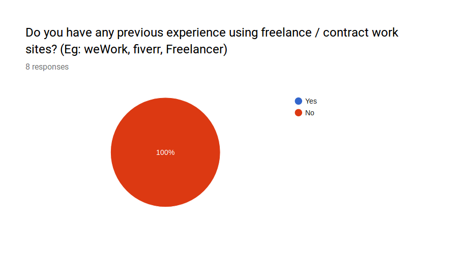    |
| None of the users surveyed had any previous experience with freelance/contract work sites. |

| **Question 3**                        |
| ------------------------------------- |
| 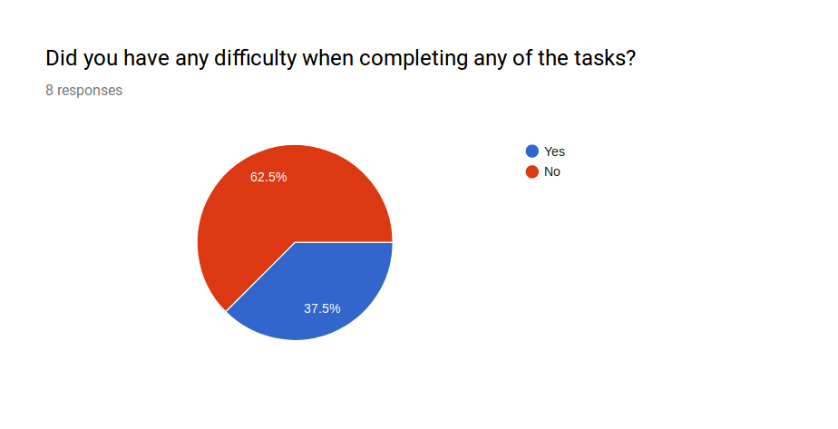    |
| Approximately 2/3 users had no difficulties at all when completing any of the tasks provided to them. |

| **Question 4**                        |
| ------------------------------------- |
| 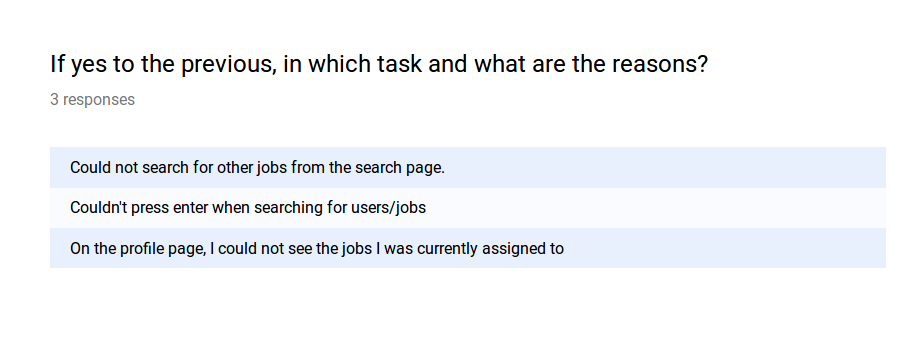    |
| 2 users had issues searching for jobs from the job pages. |
| 1 user had a problem viewing the jobs they were assigned to on thier job page. |

| **Question 5**                        |
| ------------------------------------- |
| 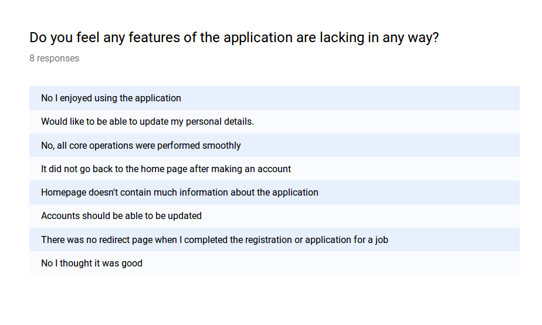    |
| 1 user would have liked the homepage to be populated more. |
| 2 users would have liked the page to redirect after registering an account or posting a job. |
| 2 users would have liked to be able to update their account details after creating an account. |
| 3 users had no problems with any of the features   |

| **Question 6**                        |
| ------------------------------------- |
| 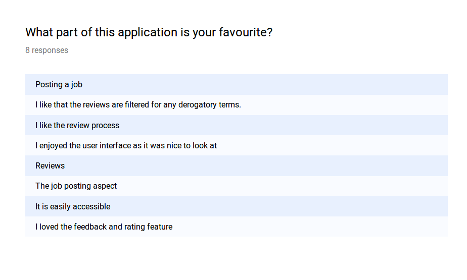    |
| Reviews turned out to be a popular feature among many of the users |

| **Question 7**                        |
| ------------------------------------- |
| 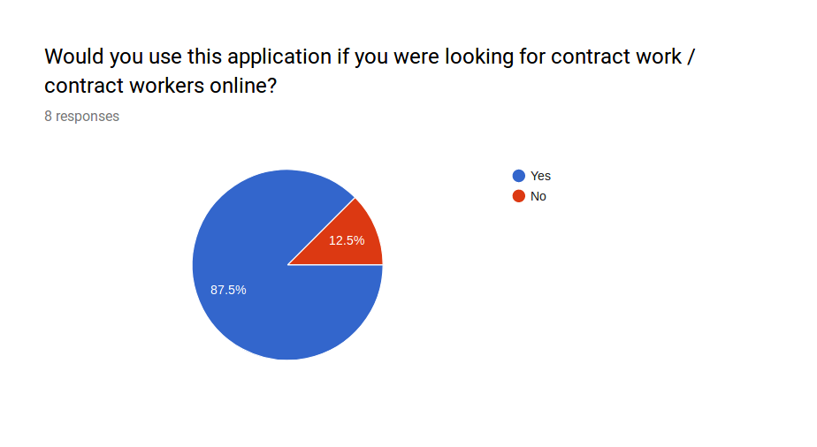    |
| A strong majority of users said that they would use the application again. |

| **Question 8**                        |
| ------------------------------------- |
| 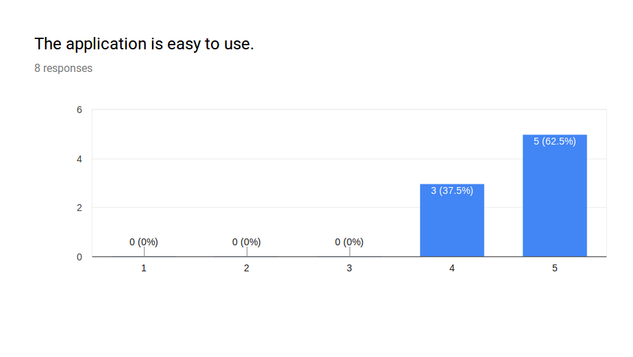    |
| All users found the application easy to use. |

| **Question 9**                        |
| ------------------------------------- |
| 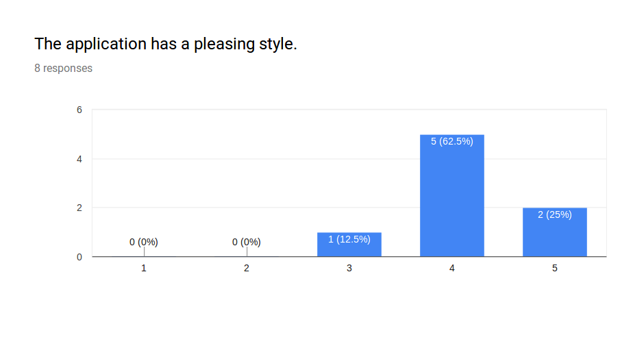    |
| Most users were pleased with the style of the application. |

| **Question 10**                       |
| ------------------------------------- |
|   |
| All users were in favour of reccomending this application to a friend. |

| **Question 11**                       |
| ------------------------------------- |
| 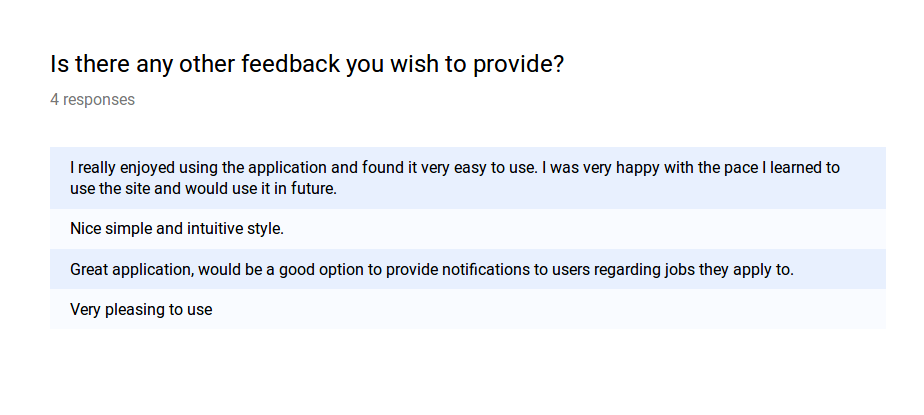  |
| All additional feedback was positive, which we were very pleased to see. |

#### Issues Found
| Issue | Fixed/Still Present |
| ------------------------------------- |
| Users were dissapointed that they weren't returned to the homepage after registering. | Fixed |
| The search page was broken on pages where the profanity filter JavaScript was also imported. | Fixed |
| Errors occurred when users attempted to post a job which paid more then the funds that they had available in their account. | Fixed |
| Apply button wasn't disabled after applying for a job. | Fixed |
| List scalability for jobs | Fixed |

###6. Known Issues

| Issue | Notes: |
| ----- | ------ |
| Editing accounts after registration | Through our user testing we learned that some of the users would have liked to edit their information after they had registered their account. Due to issues with keeping the data on our site consistantly "immutable" and time constraints, this feature was not implemented. |
| Content reporting and moderation | In cases where a user has circumvented our profanity filter or has used slander, we would have liked to incluse a system where a another user could report this and have it reviewed by a moderator. We decided that we would not yet implement this system as it would take a considerable amount of time and we would not be able to complete it in the timeframe we were given |
| Navbar welcome message | Retrieving the information from the blockchain to display whether a user is registered or not can sometimes take longer than expected. This can sometimes cause an issue where our function will return an error and not correctly display if a user has been signed in. |
| Multiple transaction boxes for a single process | When interacting with two different contracts during a single process, the transactions would be split up into two separate dialog boxes. We would have liked replace this with a batch transaction with a single dialog box, but we did not have the time to do this. |
| Open-Job list population | In our page to display only open jobs, it would not show the maximum of 10 open jobs per page, but only the number of open jobs found on the equivalent "All-Jobs" page. We found this issue too late in the development of the application and did not have time to fix it. |
| Email address privacy | As we made a decision not to include the Whisper message protocol on our application, we still needed to allow users to communicate with each other. To allow this we have included the email address of the user on their account page. We realise that this is not a good practice and would have liked to give control to users as to who is shown thier contact information, but we did not have time to implement this. |
